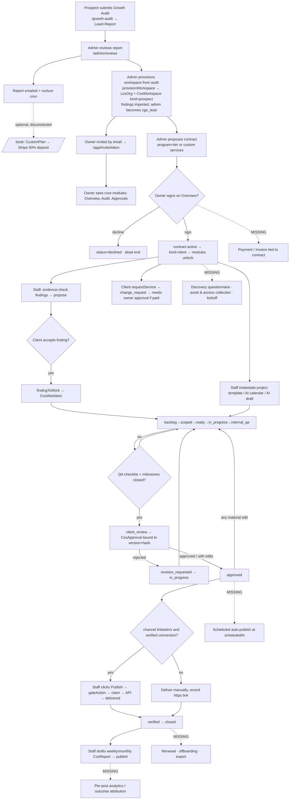
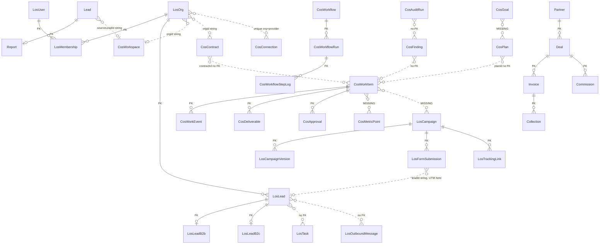

# GrowthOS — Current State Audit

Audit date: 2026-09-21 · Repository: `C:\CatalystSolutionsServices` · Branch `growthos` · Commit `c807a230460ef0c3eb36371564f3d9f97236a7c2`

**Status legend used throughout**

| Tag | Meaning |
|---|---|
| **RV** | Implemented and runtime-verified *in this audit* |
| **IC** | Implemented in code, not runtime-verified in this audit |
| **PART** | Partially implemented |
| **MOCK** | Mock / demo / placeholder |
| **ABS** | Absent from the inspected scope |
| **UNK** | Unknown or blocked |

All evidence is `repo-relative/path:line`. No secret values, customer records or production data were read or reproduced. Env names come from code references or `.env.example` only.

---

## 1. EXECUTIVE SUMMARY

### What the product currently does
One Next.js application containing four products that share a database:

1. **Marketing site + free Growth Audit funnel** (`app/(site)`, `lib/audit`) — public audit submission, AI-generated report, human review, nurture email, custom pricing plans, Stripe deposit checkout.
2. **Sales-partner portal** (`app/(site)/partner`, `lib/partner`) — applications, deal registration, quotes, invoices, collections, a commission ledger.
3. **LeadOS** (`app/app`, `lib/leados`) — multi-tenant CRM, pipeline, tasks, outreach sequences (email/SMS/WhatsApp with consent + suppression), hosted lead-capture campaigns with UTM capture, lead inventory/allocation with a token ledger, reports.
4. **CatalystGrowthOS** (`lib/os`, `app/app/(shell)`, `/admin/os`) — a managed-services delivery layer on top of LeadOS: workspace → proposed contract → client signs → entitled modules → audit findings → work items/projects with milestones and QA gates → hash-bound client approvals → deliverables (links) → reports; plus AI drafting (plans, content calendar, post drafts, SEO briefs), four OAuth connectors, and a client-built workflow automation engine.

### Which model the implementation primarily supports
By code volume and maturity the centre of gravity is **lead delivery + CRM (LeadOS)** — 37 lib files, ~70 Prisma models, 17 test files. **Agency delivery (GrowthOS)** is a newer, thinner but well-designed layer (9 lib files + 7 automation files, 18 models, 4 test files) whose *governance* core (scope, approvals, separation of duties, kill switch) is strong while its *execution* surfaces (content production, publishing, analytics) are shallow. **Marketing execution** as described in the business context (multi-platform AI content → publish → analytics → outcomes) is mostly not built: text-only drafting, manual click-publish to LinkedIn-personal and X only, Search Console the only analytics feed.

### Strongest reusable components
- Work-item state machine + approval engine bound to `(version, contentHash)` — `lib/os/workflow.ts`, `lib/os/work.ts:205-244, 285-376`.
- Scope rule: out-of-contract work auto-becomes a `change_request` — `lib/os/work.ts:70-113`.
- RBAC with enforced separation of duties (staff can never approve/sign/spend) — `lib/leados/rbac.ts:68-95`.
- Tenant resolution from membership rows only — `lib/leados/auth.ts:139-153`.
- Gated, claim-protected publish with "uncertain outcome never retries" semantics — `lib/os/work.ts:385-418`.
- Postgres job queue with idempotency keys, backoff, dead-letter — `lib/leados/jobs.ts:18-92`.
- OAuth connector framework with encrypted tokens, refresh, live verification — `lib/os/connectors.ts`.
- Workflow engine + block registry + SSRF guard — `lib/os/automation/*`.
- LeadOS lead capture with UTM, Turnstile, rate-limit, idempotency, consent/suppression — `lib/leados/submission.ts`, `app/app/c/[publicId]`.
- Partner commission ledger (rate-lock, pro-rata payable, no rounding drift) — `lib/partner/commissions.ts:33-145`.
- Attribution-grade (A–D) and "Not connected vs zero" display discipline — `components/os/Studio.tsx:30-47`.

### Main obstacles to the intended model
1. **No campaign object in GrowthOS and no link between content, publications, metrics and leads.** `CosWorkItem` has no `goalId`/`campaignId`; `CosMetricPoint` is keyed `(orgId, provider, metric, day)` only (`prisma/schema.prisma:1819-1830`). The Goal → … → sale chain is broken in at least four places (§8, §9).
2. **No content variant / publication / asset entities.** One `body` per content item; publication is a JSON blob in `CosWorkItem.outcome`; deliverables are https links; there is no file storage.
3. **Platform coverage is narrow**: publish = LinkedIn personal + X, text only; Meta is "Coming soon"; YouTube is a public RSS reader; WordPress creates drafts only from workflows; no GA4, Ads, GBP, LinkedIn company pages.
4. **`scheduledAt` does nothing** — no scheduler publishes; date-only, UTC, no workspace timezone.
5. **One connection per provider per org** (`@@unique([orgId, provider])`, `schema.prisma:1815`) — cannot hold a personal profile *and* a company page, or two brands.
6. **Client journey has no discovery/onboarding/asset-collection/payment/offboarding stages**, and self-service registration is still open (`app/app/(auth)/register`, `app/app/onboarding/actions.ts:11-45`) creating "legacy" orgs with CRM + lead supply — at odds with the "no self-service" direction.
7. **No engagement billing**: contracts carry a free-text pricing note; no client invoice, no Stripe webhook; partner `Deal/Invoice` world is disconnected from `CosContract`.
8. **AI cost/credits plumbed but never written or enforced** (§6).

### Audit coverage and verification limitations
- Covered by direct reading or delegated read-only inspection with spot-checks: all `page.tsx`/`route.ts` files, `middleware.ts`, full `prisma/schema.prisma` (1,913 lines), all of `lib/os/**`, key parts of `lib/leados`, `lib/partner`, `lib/audit`, admin actions, configs, tests inventory, `docs/os/*`.
- **Not covered line-by-line**: large client components (`KanbanBoard`, `LeadWorkspace`, `CampaignEditor`, `DiscoverClient`, workflow builder canvas), marketing-site content, `legacy/`, `leados-client/` beyond its entry file, `docs/clients/**` and `docs/sales/**` (real client/business documents — deliberately not opened), `samples/`, `Context/`, `public/`.
- **Never opened**: `.env`, `.env.local`, `production-env.txt`, `leados-production-env.txt`.
- **Runtime checks performed**: pure (no-DB) unit tests only — 13 files / 139 tests passed. `npm run typecheck` was clean earlier in this same working session (before the audit began).
- **Not run**: the 24 DB-backed test files, because local dev points at the production Neon database and those tests write rows; no OAuth, publish, AI, email, Stripe or webhook call was made; no authenticated UI session was used (admin/client login requires credentials the auditor must not enter). So **nothing in GrowthOS is tagged RV** except pure rules; UI claims of "browser-verified" in `docs/os/PROGRESS.md` are the builder's, not re-verified here.

### Branch, commit and working tree
Branch `growthos`, HEAD `c807a23`. **Pre-existing uncommitted changes (made earlier in this session, before the audit, left untouched):** `app/(site)/admin/layout.tsx`, `app/(site)/admin/leados/page.tsx`, `app/(site)/admin/os/page.tsx` — these merge the LeadOS admin hub into `/admin/os` (nav link removed, hub redirects, stat cards + "CRM only" orgs added). The audit describes the working tree, so `/admin/leados` is a redirect here but a standalone hub at HEAD.

Also note: `docs/` is **git-ignored** (`.gitignore`), yet `CLAUDE.md` makes `docs/os/blueprint.md` and `docs/leados/blueprint.md` mandatory reading. The blueprints and build logs exist only on this machine.

---

## 2. TECHNICAL MAP

| Concern | What exists | Evidence |
|---|---|---|
| Frontend | Next.js App Router, React 19 server components + server actions, Tailwind 4, React Flow for the workflow builder | `package.json:16-29` |
| Backend | Next.js route handlers + server actions; no separate API service | `app/api/**`, `app/app/(shell)/_os/actions.ts` |
| Database / ORM | PostgreSQL (Neon) via Prisma 6; `prisma db push`, additive only; **zero `enum` declarations — all states are free strings** | `prisma/schema.prisma`, `CLAUDE.md` |
| Auth | Four mechanisms: client `los_session` DB sessions + TOTP MFA (`lib/leados/auth.ts:78-116`); env-account admin cookie (`lib/audit/adminAuth.ts`, `middleware.ts:23-27`) which maps to `super_admin` (`lib/leados/auth.ts:164-174`); HMAC partner cookie + scrypt (`lib/partner/auth.ts:36-56`); API keys (`lib/leados/apiAuth.ts`) |
| Hosting | Vercel; host-based routing sends the app host to `/app` (`middleware.ts:14-21`) | `vercel.json` |
| Background jobs | Postgres queue `LosJob`, `FOR UPDATE SKIP LOCKED`, idempotency key, backoff, dead-letter (`lib/leados/jobs.ts:18-92`); handlers in `lib/leados/registerJobs.ts` |
| Scheduling | Two Vercel crons, **both daily**: `/api/cron/nurture` 06:00 UTC, `/api/leados/cron` 04:00 UTC (`vercel.json`). The route comment says "every few minutes" (`app/api/leados/cron/route.ts:7`) — workflow waits, sequences, GSC sync and the queue drain all tick once per day |
| Storage | **ABS** — no blob/S3/upload code; deliverables are https links (`lib/os/work.ts:266`, `schema.prisma:1714`) |
| Notifications | Email via Resend REST (`lib/audit/email.ts:14`, `lib/leados/email.ts:23`); SMS/WhatsApp via Twilio REST (`lib/leados/outreach.ts:32-49`); no in-app notification entity |
| Product analytics | **ABS** (gtag/plausible strings appear only in the site scraper, `lib/audit/scrape.ts:151`) |
| AI | One OpenAI-compatible chat-completions client over `fetch`, no SDK (`lib/audit/anthropic.ts:18`); env `LLM_BASE_URL`, `LLM_API_KEY`, `LLM_MODEL`; older audit pipeline uses `GEMINI_API_KEY`/`GEMINI_MODEL`. Text only |
| Integration adapters | OAuth: `gsc`, `linkedin`, `x`, `meta` (`lib/os/connectors.ts:11`); key-based workflow blocks: Slack, Discord, Teams, Telegram, Notion, Airtable, HubSpot, WordPress, RSS/YouTube RSS, generic HTTP (`lib/os/automation/blocks.ts`); LeadOS ad-lead webhooks: Meta, Google, Twilio (`app/api/leados/webhooks/*`) |
| Payments | Stripe REST, no SDK, no webhook (`app/api/book/route.ts:47-78`, `lib/leados/billing.ts:1-5`) |

**Versions** (`package.json`): next ^15.5.20 · react 19.1.0 · prisma / @prisma/client ^6.19.3 · @xyflow/react ^12.11.6 · typescript 5.7.2 · tailwindcss 4.1.13 · vitest ^3.2.7. No other runtime dependencies.

**Directory map**

```
app/(site)/            marketing pages, growth-audit funnel, /book, /plans/[token]
app/(site)/partner/    partner portal          app/(site)/admin/   agency admin (reviews, leads, plans, partners, os, leados/*)
app/app/(auth)/        client login/register/invite/MFA
app/app/(shell)/       client app: dashboard, audit, strategy, approvals, work, content, search, ads,
                       workflows, leads, pipeline, tasks, outreach, discover, deliveries, campaigns, reports, settings
app/app/(shell)/_os/actions.ts   all GrowthOS client/staff server actions
app/app/c/[publicId]   hosted public lead form     app/app/u/[token]  opt-out
app/api/               audit, book, cron, leados (cron, oauth, public forms, webhooks), os (connect, hooks), v1 (API)
lib/audit/             audit pipeline, LLM client, email, admin auth, db
lib/leados/            auth, rbac, leads, outreach, campaigns, allocation, tokens, billing, jobs, metrics, crypto
lib/os/                catalog, entitlements, guard, workflow (rules), work (engine), audit, ai, connectors, syncJob
lib/os/automation/     definition, hash, catalog, blocks, engine, manage, templates
lib/partner/           auth, deals, quotes, commissions, ledger, dashboard
components/os/         Studio and shared OS UI
prisma/schema.prisma   ~100 models        tests/ tests/leados/ tests/os/
scripts/               seed-os-demo, wipe-leados-demo, seed-price-book, audit pipeline utilities
leados-client/         separate Express proxy app (git-ignored)     legacy/  old static site
```

**Setup / safe commands.** There is no README; setup lives in `.env.example`, `docs/os/PROGRESS.md` ("Setup needed from owner") and `docs/leados/SETUP_NEEDED.md`/`RUNBOOK.md`. Safe: `npm run typecheck`; `npx vitest run <pure test files>` (list in §11). **Not safe without a separate database**: `npx vitest run` (full), `npm run dev` interactions, any `scripts/seed-*`/`wipe-*`, `npx prisma db push` — dev is wired to the production Neon DB (`CLAUDE.md`).

**Configuration names (no values)**
- From `.env.example`: `DATABASE_URL`, `GEMINI_API_KEY`, `GEMINI_MODEL`, `RESEND_API_KEY`, `EMAIL_FROM`, `SITE_URL`, `ADMIN_ACCOUNTS`, `ADMIN_SESSION_SECRET`, `CRON_SECRET`, `NEXT_PUBLIC_WEB3FORMS_ACCESS_KEY`, `STRIPE_SECRET_KEY`.
- Referenced in code/docs but **missing from `.env.example`**: `LLM_BASE_URL`, `LLM_API_KEY`, `LLM_MODEL`, `LEADOS_SECRET`, `GOOGLE_CLIENT_ID/SECRET`, `LINKEDIN_CLIENT_ID/SECRET`, `X_CLIENT_ID/SECRET`, `META_APP_ID/SECRET`, `TURNSTILE_SECRET_KEY` (+ public site key), `TWILIO_AUTH_TOKEN`, `TWILIO_WHATSAPP_FROM`, `TWILIO_SMS_FROM`, `TWILIO_WEBHOOK_URL`.
- External services required: Neon Postgres, Vercel (cron), an OpenAI-compatible LLM endpoint, Resend, Stripe, Twilio, Cloudflare Turnstile, and provider developer apps for Google, LinkedIn, X, Meta.

---

## 3. ROUTES, SCREENS AND ROLES

All statuses below are **IC** (read from code; not exercised in a browser in this audit) unless marked otherwise.

### Client app (`app/app`)

| Route | User | Purpose | Main actions | Data source | Status | Evidence |
|---|---|---|---|---|---|---|
| `/app/login, /register, /forgot, /reset, /verify, /mfa` | anyone | account lifecycle | `register`, login, TOTP | `LosUser`, `LosSession`, `LosEmailToken` | IC — **registration is open**, rate-limited | `app/app/(auth)/actions.ts:32-48` |
| `/app/invite/[token]` | invited client/staff | accept invitation | accept | `LosInvitation` | IC | `(auth)/invite/[token]/page.tsx:11` |
| `/app/onboarding` | new self-serve user | create org, accept terms/DPA | `createOrg` | `LosOrg`, `LosMembership(owner)` | IC — creates a *legacy* org with no `CosWorkspace` | `app/app/onboarding/actions.ts:11-45` |
| `/app/dashboard` | all members | Overview: proposed contract to sign, goals, deliverables vs allowance, token balance | `signContract`, `requestService` | `entitlements`, `monthlyUsage`, `CosGoal`, `CosContract` | IC | `dashboard/page.tsx:18,75,118-121` |
| `/app/audit` | client + staff | findings with evidence labels, baseline | `findingMove`, `findingToWork`, `approveBaseline` | `CosAuditRun`, `CosFinding`, `CosBaseline` | IC | `audit/page.tsx:17` |
| `/app/strategy` | client + staff | goals, AI plan versions, ±5pt diff, learnings | `saveGoal`, `draftPlan`, `submitPlan`, `decidePlan`, `proposeLearning`, `reviewLearning` | `CosGoal`, `CosPlan`, `CosLearning` | IC | `strategy/page.tsx:17`, `_os/actions.ts:210-433` |
| `/app/approvals` | client approvers | inbox + decision log | `decide`, `revoke` | `CosApproval` | IC | `approvals/page.tsx:15-18` |
| `/app/work`, `/app/work/[id]` | client + staff | work list; detail with textarea editor, checklist, comments, time, deliverables, publish | `newWorkItem`, `moveWorkItem`, `saveWorkItem`, `logWorkEvent`, `newDeliverable`, `tickChecklist`, `publishNow` | `CosWorkItem/Event/Approval/Deliverable` | IC | `work/[id]/page.tsx:21-32,95-110,207-210` |
| `/app/content` | client + staff | 14-day calendar, AI fill, AI draft | `fillCalendar`, `newContentItem`, `aiDraft` | `CosWorkItem type=content` | IC / PART (no variants, date-only, UTC) | `content/page.tsx:17-57,75` |
| `/app/search` | client + staff | graded search metrics, SEO briefs | `newSeoBrief`, `recordMetric` | `CosMetricPoint provider=gsc` | PART — only clicks/impressions have a writer | `search/page.tsx:12,17` |
| `/app/ads` | client + staff | manual graded ad metrics, tier-3 spend proposals | `recordMetric`, `newWorkItem` | `CosMetricPoint provider=ads` | PART — **no ads connector; all numbers manual** | `ads/page.tsx:14,19` |
| `/app/workflows`, `/[id]`, `/connections` | client + staff | template gallery, React Flow builder, run log, key connections | create/save/activate/pause, rotate hook token | `CosWorkflow`, `CosWorkflowRun`, `CosWorkflowStepLog`, `CosConnection` | IC | `workflows/page.tsx:19`, `lib/os/automation/manage.ts` |
| `/app/leads`, `/leads/[id]`, `/new`, `/import`, `/import/[id]` | client sales roles | CRM | create/edit/import/merge | `LosLead*`, `LosImport` | IC | `leads/page.tsx:19` |
| `/app/pipeline`, `/tasks`, `/outreach` | client sales roles | kanban, tasks, sequences/messages | stage moves, tasks, enrol, send | `LosPipelineStage`, `LosTask`, `LosSequence*`, `LosOutboundMessage` | IC | `pipeline/page.tsx:10` |
| `/app/discover`, `/deliveries` | client | lead inventory search/reveal, delivered leads | reveal, replace | `LosInventoryRecord`, `LosReveal`, `LosAllocation`, `LosTokenLedger` | IC | `discover/page.tsx:9`, `deliveries/page.tsx:11` |
| `/app/campaigns`, `/[id]` | client marketing roles | hosted lead-capture campaigns, versions, tracking links | create/publish version | `LosCampaign*`, `LosFormSubmission` | IC — list shows a raw submission count only | `campaigns/page.tsx:16,47` |
| `/app/reports` | client | 30-day LeadOS KPIs + bar chart | — | `LosDailyMetric`, `LosLead.conversionValue` | IC | `reports/page.tsx:13-96` |
| `/app/reports/notes` *(not in nav)* | staff + client | weekly/monthly narrative reports | `draftReport`, `publishReport` | `CosReport` | IC | `reports/notes/page.tsx:17,41-47` |
| `/app/settings` + `billing, team, api-keys, integrations, scoring, security, workspace` | owner/admin | team, billing, keys, brand profile, connections, kill switch | `saveBrandProfile`, `connectionAction`, `setKillSwitch` | `LosSubscription`, `CosWorkspace`, `CosConnection` | IC; Meta row shows "Coming soon" | `settings/workspace/page.tsx:18,75` |
| `/app/c/[publicId]` | public | hosted lead form (UTM capture, Turnstile) | submit | `LosCampaign`, `LosFormSubmission`, `LosAttributionEvent` | IC | `c/[publicId]/page.tsx:33-39` |
| `/app/u/[token]`, `/app/privacy`, `/privacy/verify/[token]` | public | opt-out, privacy requests | — | consent/suppression tables | IC | `app/app/privacy/page.tsx:5` |

Not linked from shell nav (`app/app/(shell)/layout.tsx:36-64`): `/app/reports/notes`, `/app/workflows/connections`, `/app/leads/new`, `/app/leads/import`, settings sub-pages.

### Agency admin (`app/(site)/admin`)

| Route | User | Purpose | Main actions | Data | Status | Evidence |
|---|---|---|---|---|---|---|
| `/admin/os` | platform admin / account lead | command centre: exceptions, all orgs, provisioning; (working tree) LeadOS stats + links | `provisionWorkspace` | `CosWorkspace`, `LosOrg`, groupBy on approvals/work | IC | `admin/os/page.tsx`, `admin/os/actions.ts:39-68` |
| `/admin/os/[orgId]` | same | contracts, staff, audits, hours, AI calls | `proposeContract`, `endContract`, `addStaff`, `removeStaff`, `attachAudit` | `CosContract`, `LosMembership`, `CosWorkEvent` | IC | `admin/os/[orgId]/page.tsx:16-47` |
| `/admin/leados/{datasets,datasets/[id],inventory,plans,tokens,reviews,privacy-requests,suppressions}` | platform roles per area | lead supply operations + compliance | dataset approve, plan edit, token grant, review decide | `LosDataset`, `LosInventoryRecord`, `LosLeadPlan`, `LosTokenLedger`, … | IC | e.g. `admin/leados/datasets/page.tsx:9` |
| `/admin/reviews`, `/reviews/[id]` | admin | approve/reject AI growth-audit reports | approve/reject | `Report` | IC — **page has no in-page guard; middleware only** | `middleware.ts:23-27` |
| `/admin/leads` | admin | marketing audit leads, sales status | status updates | `Lead` | IC — middleware-only guard | same |
| `/admin/plans`, `/plans/new`, `/plans/[id]` | admin | custom pricing proposals | create/send | `CustomPlan`, `PriceBook` | IC — middleware-only guard | same |
| `/admin/partners`, `/applications`, `/deals`, `/commissions`, … | admin / deal desk / finance | partner ops | approve, win deal, invoice, collection, commission states | `Partner`, `Deal`, `Invoice`, `Collection`, `Commission` | IC | `admin/partners/page.tsx:3` |

### Partner portal and marketing

| Route | User | Purpose | Status | Evidence |
|---|---|---|---|---|
| `/partner`, `/partner/deals`, `/deals/new`, `/deals/[id]`, `/deals/[id]/quote`, `/partner/earnings`, `/partner/login` | sales partner | register deals, quote, track commissions | IC, per-page `partnerPage()` guard | `lib/partner/page-guards.ts:7-11` |
| `/`, `/services/[slug]`, `/industries`, `/use-cases`, `/add-ons`, `/about`, `/contact`, `/privacy`, `/partners`, `/partners/apply…` | prospects | marketing, partner application | static / DB-backed forms | `lib/content.ts`, `lib/services.ts`, `lib/programs.ts` |
| `/proof`, `/proof/samples/[slug]`, `/proof/sites/[slug]`, `/bundles/[slug]` | prospects | demos | **MOCK by design** — carries `fictionalNote` | `app/(site)/proof/page.tsx:6` |
| `/growth-audit`, `/growth-audit/report/[token]`, `/doctors/audit` | prospects | audit funnel | IC, DB-backed | `app/api/audit/submit/route.ts:52` |
| `/book`, `/book/success`, `/plans/[token]` | prospects | 50% deposit checkout, plan view | IC, Stripe redirect-settled | `app/api/book/route.ts:27,47-78` |

`app/_work`, `app/_resources` are Next private folders (not routable); `legacy/` is a dead static site; `leados-client/` is a separate Express proxy to `/api/v1/leads`.

### Roles (actual)

| Set | Roles | Evidence |
|---|---|---|
| Client | `owner, admin, campaign_manager, sales_manager, sales_rep, analyst` | `lib/leados/rbac.ts:5-12` |
| Catalyst staff inside a client workspace | `cgo_lead, cgo_specialist, cgo_reviewer, cgo_freelancer` | `lib/leados/rbac.ts:19` |
| Platform | `super_admin, compliance_admin, inventory_admin, campaign_admin, support_admin, auditor` | `lib/leados/rbac.ts:22-29` |
| Partner portal (separate user table) | `partner, deal_desk, admin, finance, super_admin` | `lib/partner/auth.ts:8` |

There is **no distinct "account manager" role** — it is `cgo_lead` inside a workspace plus platform admin outside it.

**Role enforcement.** 25 permissions and a static matrix (`rbac.ts:34-95`). Staff never hold `approvals.decide`/`spend.approve`/`contract.sign` (`:87`); client roles can never get `work.manage/execute/review` or `strategy.manage` (`:68-71`). Freelancers see assigned items only (`lib/os/work.ts:41`). Clients cannot grant staff roles (`isClientRole` check, `rbac.ts:18,102`); only `/admin/os` does (`admin/os/actions.ts:70-100`). Every server action re-checks (`_os/actions.ts`), pages are convenience guards. Pure tests for this matrix passed in this audit (`tests/os/workflow.test.ts`, `tests/leados/rbac.test.ts`) — **RV for the rule tables, IC for their wiring.**

**Tenant isolation.** Org comes from membership rows; the `los_org` cookie only selects among them (`lib/leados/auth.ts:139-153`); `switchOrg` re-verifies (`_os/actions.ts:43-51`). No client action takes `orgId` from input. Deliberate exceptions: platform-admin actions take `orgId` from forms behind `requirePlatform` (`admin/os/actions.ts:72,105`; `admin/leados/plans/actions.ts:15,111`); inbound hook derives org from a hashed path token (`app/api/os/hooks/[token]/route.ts:13-16`). At the database level only 4 models have a real FK to `LosOrg`; every `Cos*` model holds `orgId` as a plain string (§9) — isolation is application-enforced only.

**Organisation switching.** Staff with memberships in several workspaces get a switcher; same mechanism as above.

**Internal information exposed to clients?** Correctly gated in code: internal events filtered for non-staff (`work/[id]/page.tsx:27`); time and AI cost always `internal: true` and clients can never post internal notes (`lib/os/work.ts:255-256`); estimated minutes shown to `work.manage` only (`work/[id]/page.tsx:105-110`). By design clients *do* see QA checklist labels and `incrementalCharge`.

**Entitlement gap (verified by grep).** GrowthOS studio pages use `requireModule` (`lib/os/guard.ts:9-13`). CRM / lead-supply pages — `/app/leads`, `/pipeline`, `/tasks`, `/outreach`, `/discover`, `/deliveries`, `/campaigns` — use bare `requireOrg(perm)` and never check `ent.modules`. For a workspace that did not buy `crm`/`lead_supply`, nav hiding is the only control; direct URLs work.

---

## 4. EXISTING CLIENT JOURNEYS



| Stage | Reality | Evidence |
|---|---|---|
| Registration / invitation | **Two entry paths.** Managed: admin provisions and emails a 7-day invite (`admin/os/actions.ts:20-36,64`). Self-serve: open `/app/register` → `/app/onboarding` creates a legacy org with CRM + lead supply + intelligence (`onboarding/actions.ts:28-38`, `lib/os/entitlements.ts:12`) | IC |
| Prospect / audit submission | Public form → scrape → LLM report → admin approve → email | `app/api/audit/submit/route.ts`, `/admin/reviews` · IC |
| Workspace creation | `provisionWorkspace`: requires a delivered report if from audit, one workspace per audit lead, imports findings, `kind=prospect` | `admin/os/actions.ts:39-68` · IC |
| Discovery & business profile | **PART** — only a 7-field brand profile JSON (voice, audience, offers, proofPoints, dos, donts, competitors) in Settings → Workspace (`_os/actions.ts:363-370`); no discovery questionnaire, readiness assessment, ICP/persona entity or intake checklist | |
| Scope / proposal acceptance | Admin proposes; owner (needs `contract.sign`) signs or declines in-app; signing flips workspace to `client`. Signed contracts are never edited — change = new row | `admin/os/actions.ts:103-131`, `_os/actions.ts:159-172` · IC |
| Payment | **ABS for engagements.** `CosContract.pricing` is a free-text note. The `/book` Stripe deposit belongs to `CustomPlan` and is not linked to `CosContract`. LeadOS token packs/subscriptions are a separate billing path | `admin/os/actions.ts:124`, `app/api/book/route.ts` |
| Account connections & asset collection | Connections: OAuth for gsc/linkedin/x in Settings → Workspace (**IC, never live-verified** per `docs/os/PROGRESS.md:51`). Asset collection (logins, brand files, access checklist): **ABS** | |
| Strategy & work planning | Goals, AI plan versions with owner approval on ±5pt allocation moves, approved learnings feed prompts | `lib/os/workflow.ts:152`, `_os/actions.ts:236-290` · IC |
| Assignment & execution | `assigneeId`/`reviewerId` (manager-only), time logging, project templates with milestones | `lib/os/work.ts:116-138,214-215` · IC. Capacity: ABS |
| Internal review | `internal_qa` gate: all checklist items ticked, all milestones closed | `lib/os/work.ts:156-163` · IC (rules RV via pure tests) |
| Client approval & revision | Approval bound to `(version, contentHash)`, 14-day expiry, reject needs reason, approve-with-edits stores diff, revoke supported; tier-3 / paid change needs `spend.approve` (owner) | `lib/os/work.ts:285-376` · IC |
| Publishing / deployment | Manual click, LinkedIn personal + X text only; everything else "deliver manually and record the link" (`work.ts:393`). Website/software "launch" milestones are tier-3 approvals with no deploy integration | IC |
| Measurement & reporting | LeadOS 30-day KPIs; GSC daily sync; manual graded metrics; narrative reports | §8 |
| Renewal, scope change, offboarding | Scope change: **IC** (`change_request`). Renewal: ABS (no term/end date logic, no reminders). Offboarding: `endContract` flips status only (`admin/os/actions.ts:133-141`); no export, handover or data-deletion flow | |

**Branching that actually exists in code**
- `entitlements.kind`: `legacy` (no `CosWorkspace`) | `prospect` | `client` (`entitlements.ts:45`).
- Purchased scope → modules → nav + `requireModule`.
- Service in contract? → `task/content/project` vs forced `change_request` (`work.ts:76-77`).
- `clientReviewRequired` flag and `riskTier 0–3` → `gateAction` (`workflow.ts:127-150`).
- Paid change or tier 3 → owner-only decision.
- Kill switch → blocks tier ≥ 2, all outreach, every workflow step.
- Channel + connection status → publish vs manual.

**Branching that does not exist**: by client goal, by readiness, by "who performs the work" (client DIY vs Catalyst vs hybrid), by account-access availability. There is no journey/stage entity — the client's "next action" is inferred ad hoc on the dashboard (proposed contract, pending approvals).

**Blocked states / owners.** `blocked` stores `stateBefore` and returns to it; `failed` after publish error; `revision_requested` after rejection. Owners: `ownerId` (creating staff), `assigneeId`, `reviewerId`. Dependencies exist only as free text inside `decision` JSON and `parentId` for project → milestone.

---

## 5. SERVICE COVERAGE MATRIX

Common to **every** service: a catalogue entry with milestones + QA checklist (`lib/os/catalog.ts:44-117`) that instantiates a project with milestone work items, approvals and link deliverables. That generic workflow is the "Existing functionality" baseline below; rows list only what exists *beyond* it.

| Service area | Beyond-baseline functionality | Status | Client workflow | Operator workflow | Reusable code | Missing connections | Evidence |
|---|---|---|---|---|---|---|---|
| Strategy, ICP/personas, competitors, GTM, funnel | Goals; AI "CMO plan" with channel allocation, evidence citations, versioning, owner approval; learnings store. Competitor analysis exists only in the marketing audit pipeline | PART | view/approve plan, set goals | draft plan w/ constraints, submit | `lib/os/ai.ts:44-65,121-130`; `lib/audit/competitors.ts` | No ICP/persona entity; competitors are a text field; no funnel model; plan not linked to goals or work by FK | `_os/actions.ts:210-290` |
| Branding, voice, assets | Brand profile JSON (7 fields) injected into prompts | PART | edit in settings | same | `ai.ts:100,110` | No asset library/storage, no guidelines, no content pillars | `_os/actions.ts:363-370` |
| Websites, landing pages, CRO, maintenance | Website project template (7 milestones, 6 QA items, tier-3 launch); LeadOS hosted landing form with versions | PART | approve milestones | tick QA, add links | `catalog.ts:52-56`; `LosCampaign*` | No staging/deploy link, no A/B (listed "not built"), no care-plan recurrence | `docs/os/blueprint.md:104` |
| Custom software, apps, MVPs, portals | Template only | PART (generic) | approve | links | `catalog.ts:93-98` | No repo/issue/release integration | |
| Technical/content SEO, AEO/GEO, local SEO | GSC OAuth + daily clicks/impressions; AI SEO brief; Search Studio; audit findings import | PART | view metrics, approve briefs | sync, brief, enter metrics | `connectors.ts:195-222`, `ai.ts:154-161` | `ai_citations`, `indexed_pages` have no writer; no rank tracking, no crawl, no page-level data | `search/page.tsx:17` |
| Paid advertising & creative | Ads Studio: manual metrics, tier-3 spend proposals; LeadOS Meta/Google **lead-form webhooks** ingest ad leads | PART | approve spend | enter numbers | `gateAction`; `app/api/leados/webhooks/{meta,google}` | No Google/Meta Ads API, no spend sync, no creative assets | `ads/page.tsx:19` |
| Social content, community, video | 14-day calendar, AI calendar fill, AI post draft with expertise flags, publish to LinkedIn-personal/X text | PART | approve posts | draft, QA, click publish | `ai.ts:72-93,132-152`, `work.ts:385-418` | No variants, media, scheduler, engagement read-back, community inbox; video = text only | §6 |
| Blogs, sales copy, email, case studies, whitepapers | Same drafting; WordPress **draft** creation from workflows; LeadOS message templates & sequences | PART | approve | draft | `blocks.ts:231-257`; `LosMessageTemplate`, `LosSequence*` | No blog publish from a work item, no long-form editor, no document assets | |
| CRM, qualification, follow-up, automation | Full LeadOS CRM + scoring + sequences w/ consent; workflow engine (35 blocks, 31 templates) | **IC, most complete area** | full self-use | staff build, client activates | `lib/leados/*`, `lib/os/automation/*` | No opportunity entity; HubSpot = one-way contact upsert; daily cron tick limits waits | `docs/os/PROGRESS.md:87` |
| Ecommerce, product pages, marketplaces | Template only | PART (generic) | — | — | `catalog.ts:99-104` | No store/marketplace integration | |
| Reviews, reputation, GBP | Template only (tier-2 review-request & reply milestones) | PART (generic) | approve replies | — | `catalog.ts:111-116` | No GBP API, no review ingestion | |
| Analytics, attribution, reporting | LeadOS daily rollups; `CosMetricPoint` w/ grades; narrative reports with forced limitations text | PART | read reports | draft/publish reports | `lib/leados/metrics.ts`, `_os/actions.ts:436-489`, `Studio.tsx` | GA4 scope requested, no query; UTMs stored, never reported; no content/campaign-level metrics | §8 |
| Recurring delivery, capacity, billing, partner ops | Monthly deliverable count vs allowance; partner commission system | PART | sees usage tile | — | `entitlements.ts:56-63`, `lib/partner/*` | No recurring task generation, capacity model, client invoicing, or partner↔contract link | §10 |

---

## 6. CONTENT AND AI WORKFLOW

| Step | Status | Evidence / note |
|---|---|---|
| Business context | IC | `CosWorkspace.brandProfile` JSON: voice, audience, offers, proofPoints, dos, donts, competitors (`_os/actions.ts:365`). **No content pillars, no tone examples.** Injected via `tenantContext` (`lib/os/ai.ts:97-117`) |
| Objective | IC | `CosGoal`; not FK-linked to plans or content |
| Campaign brief | **ABS** | No campaign entity in GrowthOS. Only an SEO brief (`ai.ts:154-161`). Calendar items carry topic/hook/format/CTA |
| Research / sources | PART | Grounding = this tenant's org record, goals, latest audit scores, ≤40 findings, ≤20 approved learnings (`ai.ts:98-106`). **No source documents, URLs, or approved-claims library** |
| Generation | IC | `draftContent` (`ai.ts:143-152`), `generateCalendar` (`:132-141`), `generatePlan` (`:121-130`). Output → validators → draft work item; failures discarded (`_os/actions.ts:240,341`) |
| Platform adaptations | **ABS** | One `body` per item; only an X length check at publish (`connectors.ts:247`) |
| Asset production | **ABS** | No image, video, audio or design generation; no upload |
| Internal review | IC | QA checklist gate (`work.ts:160-163`) |
| Client approval | IC | hash-bound (`work.ts:285-359`) |
| Scheduling | **MOCK-like** | `scheduledAt` stored and drawn on the calendar; **nothing reads it to publish** (grep: only `content/page.tsx`, `_os/actions.ts`, `work.ts` setters) |
| Publication | PART | manual click; LinkedIn personal + X text |
| Analytics | PART | GSC only; nothing per post |
| Recommendations | PART | `CosLearning` proposed → reviewer-approved → feeds prompts (`_os/actions.ts:410-433`, `ai.ts:105`); no automatic recommendation from performance data |

**Deterministic validators** (`lib/os/ai.ts`): `copyProblems` :19-27 (banned claims such as guarantees / "#1 on Google", malformed URLs, placeholder text); `validatePlan` :44-65 (allocation sums to 100±1, strips evidence IDs not belonging to the tenant, rejects uncited recommendations without assumptions); `validateCalendar` :72-93 (channel allow-list, day bounds, topic present). `expertiseFlags` are model-self-reported and advisory. Pure tests for these passed in this audit.

**Text / image / video.** Text: IC. Image: ABS. Video: ABS — the only "video" code is a public YouTube RSS reader (`blocks.ts:194`) and workflow templates that turn a video *title/transcript into text drafts* (`templates.ts:63-66`). **A generated script is the furthest the system goes; nothing renders, edits, uploads or publishes a video, and there is no long-form vs Shorts/Reels distinction anywhere.**

**Repurposing / parent–variant.** `CosWorkItem.parentId` is used only for project → milestone (`work.ts:126-131`). No content parent/variant relation.

**Editor, assets, versions, comments.** Plain `<textarea>` (`work/[id]/page.tsx:95`). Assets: https links in `CosDeliverable`, versioned by count (`work.ts:262-270`). `CosWorkItem.version` increments but **previous bodies are not retained** — only approve-with-edits keeps a before/after diff (`work.ts:333-340`). Comments are append-only events with an internal flag.

**Edits invalidate approvals — yes** (read directly): `editWorkItem` re-hashes; if changed → version+1, live approvals `revoked`, and items in `client_review/approved/scheduled` drop to `internal_qa` (`work.ts:205-244`). Re-checked at decision (`work.ts:325`) and at the publish gate (`workflow.ts:142`). Checklist ticks are excluded from the hash on purpose (`work.ts:28-35`).

**Calendar / timezone / status.** 14-day grid, date-only inputs, rendered with `timeZone: "UTC"` (`content/page.tsx:42,75`). No workspace timezone field exists.

**Failures, retries, duplicates** (read directly, `work.ts:385-418`): gate re-checked immediately before the call; atomic claim (`updateMany … outcome: null`) blocks double publish; definite provider rejection clears the claim (retryable by a human); timeout/network drop marks `uncertain` and never retries. Publishing has no automatic retry.

**AI usage, cost, tenancy.** `aiCredits` allowance is summed and `monthlyUsage` aggregates `aiCostMicros` (`entitlements.ts:38,60`), and the admin page shows "AI calls" (`admin/os/[orgId]/page.tsx:28,46`) — but **no code writes `aiCostMicros` or a `kind:"ai"` event** (grep-verified: the only references are the schema, the `addWorkEvent` signature and the two aggregates). No AI quota is enforced. Tenancy of prompts is sound (context queried per `orgId`). Studio prompts send no lead personal data; workflow `ai.generate` may include lead fields by design (owner decision 2026-09-19 recorded in `CLAUDE.md`), with redacted step logs (`definition.ts:172`, `engine.ts:78`).

---

## 7. PLATFORM INTEGRATION MATRIX

"Code" = implementation present. **No integration has evidence of user authorisation, provider app approval or a live round trip** — `docs/os/PROGRESS.md:51` states this explicitly. Every row's "Unverified" column needs separate confirmation outside this repository.

| Platform / account type | Content creation | Publishing | Analytics | Auth / scopes (as written in code) | Background sync | Status | Evidence | Unverified requirements |
|---|---|---|---|---|---|---|---|---|
| YouTube | text drafts *about* a video (workflow templates) | none | none | none — public channel RSS | workflow trigger on cron tick | IC, read-only | `blocks.ts:194`, `templates.ts:63-66` | YouTube Data API project, OAuth consent, upload scope + quota and API audit for uploads; Analytics API |
| X | AI text | `POST api.twitter.com/2/tweets`, text, length check | none | OAuth2 PKCE: `tweet.read tweet.write users.read offline.access` | token refresh only | IC | `connectors.ts:50-51,247-248` | Paid API tier permitting writes; app approval; media upload; read metrics tier |
| LinkedIn — personal profile | AI text | `POST api.linkedin.com/v2/ugcPosts`, `shareMediaCategory: NONE` | none | `openid profile w_member_social` | none | IC | `connectors.ts:43,235-239` | "Share on LinkedIn" product on the app; versioned Posts API migration; image/video assets API |
| LinkedIn — company page | — | — | — | no `w_organization_social` / `r_organization_social` | — | **ABS** | — | Community Management API access (LinkedIn review), page-admin authorisation |
| Facebook Pages | channel label only | throws | none | `pages_show_list,pages_read_engagement` (read-only; no `pages_manage_posts`) | — | **MOCK — "Coming soon"**, `providerEnabled` false | `connectors.ts:55-63,252`; `settings/workspace/page.tsx:75` | Meta app review + business verification; page tokens |
| Instagram | channel label only | none | none | none (`instagram_content_publish` absent) | — | **ABS / Coming soon** | same | IG professional account linked to a Page; app review; media must be hosted at a public URL → needs storage |
| WordPress | workflow action | **draft only** `POST {site}/wp-json/wp/v2/posts` `status:"draft"`; set tags/categories; read latest post | none | Application Password stored encrypted as one `site|user|pass` field | trigger on cron tick | IC (workflow only; not reachable from a content work item's Publish button) | `blocks.ts:69-71,231-257` | Per-site app password; REST enabled; media endpoint for images |
| Other blog/CMS | Notion page create; generic HTTPS request | n/a | none | integration token / none | — | IC | `blocks.ts:207`, `definition.ts:177-187` | — |
| Google Search Console | n/a | n/a | clicks, impressions/day, grade B | `openid email …/webmasters.readonly …/analytics.readonly` | daily idempotent job per verified connection | IC | `connectors.ts:35,195-222`; `syncJob.ts:12-15` | Google OAuth consent-screen verification; user must own the property |
| GA4 | — | — | **no query code** though scope is requested | `analytics.readonly` (unused → over-scoped) | — | **ABS** | grep: no `analyticsdata` reference | Data API enablement; property ID selection UI |
| Google Ads | — | — | none | none | — | **ABS** (lead-form webhook only, shared-secret `google_key`) | `app/api/leados/webhooks/google/route.ts:24,45` | Developer token + access level approval |
| Meta Ads | — | — | none | none | — | **ABS** (lead-ads webhook only, HMAC-verified) | `webhooks/meta/route.ts:19-29,60` | Marketing API access, `ads_read` review |
| Google Business Profile | — | — | — | — | — | **ABS** | — | GBP API access request (allow-listed) |
| HubSpot | n/a | one-way contact upsert from workflows | none | private-app token | — | IC | `blocks.ts:223-227` | — |
| Slack / Discord / Teams / Telegram / Airtable | n/a | notification posts from workflows | — | webhook URL / token, host-validated | — | IC | `blocks.ts:168-174,206-218,263-267` | — |
| Email / SMS / WhatsApp to leads | templates, AI | via `sendOutreachMessage` (consent, suppression, caps, kill switch) | delivery events via Twilio webhook | Resend / Twilio keys | sequence tick (daily) | IC | `lib/leados/outreach.ts`, `blocks.ts:136-141` | Twilio WhatsApp sender approval; sending domain |

Token handling: AES-256-GCM (`lib/leados/crypto.ts`), refresh within 2 min of expiry with X rotation (`connectors.ts:150-171`), destroyed on disconnect (`:180-186`), OAuth `state` cookie pins provider + org and the callback re-derives org from membership (`app/api/os/connect/[provider]/callback/route.ts:22`). **Structural limit:** `CosConnection @@unique([orgId, provider])` — one account per provider per workspace.

---

## 8. ANALYTICS AND ATTRIBUTION

### Visible metrics

| Surface | Metric | Definition / source | Calculation | Refresh | Range / TZ | Real vs demo | Missing ≠ zero? |
|---|---|---|---|---|---|---|---|
| `/app/reports` | New leads, Delivered vs quota, Contact rate, Conversion rate, Views→submits, Messages, Tokens | `LosDailyMetric` JSON rolled from `LosLead`, `LosAllocation`, `LosFormSubmission`, `LosAttributionEvent`, `LosOutboundMessage`, `LosTokenLedger` | `lib/leados/metrics.ts:21-54`; page sums 30 days (`reports/page.tsx:20-29`) | on page view (`:13`) + job: yesterday + today ~2-hourly *if the cron ran that often* — it runs daily | 30 days, **UTC day boundaries**, no org TZ | real rows; **`demo` not filtered** | rates show "—" on zero denominator (`:45`) |
| `/app/reports` | Pipeline won | `sum(LosLead.conversionValue)/100` | `reports/page.tsx:39-42` — **no date filter**, unlike neighbours; currency inferred from `org.market` | on view | all-time | real | 0 shown as 0 |
| `/app/dashboard` | Goal current value | `CosGoal.currentValue` + label measured/estimated/unavailable | manual | manual | — | — | "Not connected" when null (`dashboard/page.tsx:75`) |
| `/app/dashboard` | Deliverables this month vs allowance | work items in delivered/verified/closed by `updatedAt` since UTC month start | `entitlements.ts:56-62` (uses `updatedAt`, so any later touch re-dates it) | live | calendar month UTC | allowance numbers are placeholders (`catalog.ts:146-151`) | — |
| `/app/search` | clicks, impressions | GSC → `CosMetricPoint` grade B | `connectors.ts:195-222`, 28-day window, 2-day lag | daily job | UTC days | real once connected | "Not connected" + day-count (`Studio.tsx:46-47`) |
| `/app/search` | ai_citations, indexed_pages | **no writer**; manual only | — | — | — | — | yes |
| `/app/ads` | spend, clicks, leads, sqls | **manual only** | `_os/actions.ts:392-408` | manual | — | — | yes |
| `/app/reports/notes` | report table | baseline/audit scores, lead count, metric groupBy, goals | `_os/actions.ts:442-463` | at draft time; published reports immutable | period string | — | `null` → "unavailable"; limitations sentence always appended (`:462`) |
| `/admin/os/[orgId]` | Hours logged, AI calls | `CosWorkEvent` sums | `page.tsx:27-28,45-46` | live | all-time | **AI calls will always be 0** (no writer) | no |
| `/app/campaigns` | submissions per campaign | count | `campaigns/page.tsx:47` | live | all-time | real | — |

Charts are hand-built from live rows (no placeholder charts found); empty states read "No data yet".

### Evaluation

| Capability | State |
|---|---|
| Individual content performance | **ABS** — `externalId` saved (`work.ts:405`), never read back |
| Platform-specific metrics | GSC only |
| Campaign comparisons | **ABS** |
| Organic vs paid | **ABS** |
| UTM / campaign identifiers | **Captured, never reported** — `app/app/c/[publicId]/page.tsx:33-39`, `lib/leados/submission.ts:157,164`, stored on `LosFormSubmission.utm`, `LosAttributionEvent.utm`; ad-webhook leads get synthetic `utm_source`. QA checklist asks for "UTM-stamped" links (`catalog.ts:73`) but nothing generates them for published posts |
| Website events & lead capture | Hosted LeadOS forms + public API + ad-lead webhooks. **No tracking snippet for the client's own website** |
| Qualified leads / opportunities / revenue | `qualified` is a pipeline stage string; no opportunity entity; revenue = single `LosLead.conversionValue` |
| Attribution method | last-touch-at-capture on the form submission; A–D grade is assigned, not derived (`workflow.ts:165-172`); limitations are stated in reports |
| Last-sync / errors / disconnected | `CosConnection.status, lastCheckedAt, lastError` persisted and surfaced (`connectors.ts:137,168,207`; `Studio.tsx:38`) — good |

### Can the model connect Goal → campaign → content variant → published post → visit/enquiry → opportunity → sale?
**No.** Link by link:

| Link | State |
|---|---|
| Goal → plan / work | no `goalId` on `CosPlan` or `CosWorkItem` |
| Campaign | GrowthOS has none; `LosCampaign` is a lead-capture form, unrelated to `CosWorkItem` |
| Content variant | entity absent |
| Published post | JSON in `CosWorkItem.outcome`; no URL, no queryable row |
| Post → visit | `CosMetricPoint` has no work-item, campaign or URL dimension |
| Visit/enquiry → lead | **exists** in LeadOS: submission (UTM, trackingCode) → `leadId` (string, no FK) |
| Lead → opportunity → sale | no opportunity; `status=converted` + `conversionValue`; partner `Deal→Invoice→Collection` is a separate, org-less subgraph |

The only end-to-end-ish path today is *tracking link / UTM → hosted form → LosLead → conversionValue*, and it is not reported on.

---

## 9. DATA MODEL AND RELATIONSHIPS

`prisma/schema.prisma`, 1,913 lines, ~100 models, **no enums**, additive `db push` (no migrations history).



| Concept | Existing model | Line | Note |
|---|---|---|---|
| Tenant | `LosOrg` (+ `CosWorkspace` config, orgId PK) | 401 / 1474 | |
| User | `LosUser`; separate `User` for partner portal | 379 / 102 | duplicated |
| Role | `LosMembership.role` string; `LosUser.platformRole` | 428 | |
| Engagement | *approximated* by `CosWorkspace.kind` + set of contracts | 1476 | **proposed need**: explicit engagement with stage, term, owner |
| Scope | `CosContract` (services/modules/allowances/pricing as JSON strings, `parentId`) | 1496 | |
| Goal | `CosGoal` | 1586 | unlinked |
| Audit / Finding | `CosAuditRun`, `CosFinding`; marketing `Report` | 1526 / 1547 / 47 | |
| Strategy | `CosPlan` (versioned, unique org+version) | 1607 | |
| Campaign | `LosCampaign` (lead form only) | 1214 | **proposed need**: marketing campaign |
| Project / Work item | `CosWorkItem` types | 1629 | |
| Dependency | none (`parentId`, free-text JSON) | 1632,1656 | **proposed need** |
| Asset | none (`CosDeliverable.url`) | 1708 | **proposed need** |
| Content variant | none | — | **proposed need** |
| Approval | `CosApproval` (polymorphic subject, hash-bound) | 1727 | |
| Revision | `version` counter only; no snapshot table | 1646 | **proposed need** |
| Connected account | `CosConnection`; `LosAdConnection` | 1795 / 1305 | duplicated concept |
| Publication | none (`outcome` JSON) | 1664 | **proposed need** |
| Metric snapshot | `CosMetricPoint`; `LosDailyMetric` | 1819 / 941 | no content/campaign dimension |
| Contact / Lead | `LosLead`, `LosCompany`; marketing `Lead`; partner `Client` | 511 / 605 / 12 / 225 | triplicated |
| Opportunity | none in CRM (stage string); partner `Deal` | 240 | **proposed need** |
| Automation | `CosWorkflow*`; `LosSequence*`; `LosJob` | 1837 / 1116 / 359 | |
| Invoice | partner-side `Invoice`, `Collection` only | 280 / 296 | none for client engagements |
| Usage | `LosTokenLedger`; `CosWorkEvent.aiCostMicros` (never written) | 895 / 1696 | |
| Notification | none | — | **proposed need** |

**Structural weaknesses**
- **Weak tenant scoping at DB level**: only `LosMembership`, `LosInvitation`, `LosApiKey`, `LosLead` FK to `LosOrg`. All 18 `Cos*` models and most `Los*` models carry `orgId` as a plain string — no cascade, no referential integrity; isolation depends on every query including `orgId`.
- **Dangling references**: `CosWorkItem.parentId/contractId/findingId/planId`, `CosFinding.auditRunId/workItemId`, `CosApproval.subjectId`, `LosFormSubmission.leadId`, `LosTask.leadId`, `LosOutboundMessage.leadId`, `CosLearning.workItemIds` (JSON array).
- **Duplicated concepts**: `Lead`/`LosLead`; `User`/`LosUser`; `Report`/`CosReport`; `AuditLog`/`LosAuditEvent`; three "plans" (`CustomPlan` pricing, `LosLeadPlan` quota, `CosPlan` strategy); two pricing/contract worlds (`PriceBook`+`Deal` vs `CosContract.pricing` note); `CosConnection` vs `LosAdConnection`.
- **JSON-in-string columns** for everything variable (`payload`, `decision`, `commercial`, `outcome`, `services`, `modules`, `allowances`, `brandProfile`) — cannot be indexed, joined or constrained; this is what blocks per-channel, per-campaign and per-publication reporting.
- **Lifecycle gaps**: no engagement stages (discovery/onboarding/active/paused/renewal/offboarded); contract has no term, renewal date or billing status column; content has no per-variant state; `scheduled` state exists but nothing acts on it.
- Good: idempotency uniques (`LosJob.idempotencyKey`, `CosWorkflowRun(workflowId,eventKey)`, `CosMetricPoint(org,provider,metric,day)`, `CosReport(org,kind,period)`), append-only ledgers by convention (`CosWorkEvent`, `CosBaseline`, `LosTokenLedger`, `LosConsentEvent`, `CommissionRate`) — convention only, not DB-enforced.

---

## 10. DELIVERY AND COMMERCIAL OPERATIONS

| Topic | Finding | Evidence |
|---|---|---|
| Service catalogue | 12 services in code, each → studio, modules, milestones, QA checklist; 10 programs → default bundles; 3 tiers | `lib/os/catalog.ts:44-141` |
| Scope entitlements | union of ACTIVE contracts + core modules; `automations` for any active contract | `lib/os/entitlements.ts:24-53` |
| Allowances | `deliverablesPerMonth, reviewCycles, aiCredits, responseHours` — **explicit placeholders**; only deliverables are displayed; `reviewCycles`, `aiCredits`, `responseHours` are **never enforced** | `catalog.ts:146-151` |
| Milestones & acceptance | Milestone work items from template; QA checklist is the acceptance gate; no per-milestone acceptance criteria text beyond the title | `work.ts:116-163` |
| Assignments & capacity | assignee/reviewer, time logs. **Capacity / utilisation: ABS** | `work.ts:214-215` |
| Client vs internal notes | `CosWorkEvent.internal`, enforced server-side | `work.ts:255-256` |
| Approvals & decision history | decision log page, append-only events, audit log entries | `approvals/page.tsx`, `logLosAudit` calls |
| Scope changes & fees | `change_request` + `commercial.incrementalCharge`; paid → owner with `spend.approve`. **No invoice or payment is generated**; `paymentStatus` is a JSON key with no writer found | `work.ts:312-351`; `schema.prisma:1658` |
| Recurring work / retainers | **ABS** — no recurring work-item generation, no monthly cycle object, no renewal | |
| Billing & collection | Engagements: **ABS**. LeadOS: Stripe Checkout for token packs/subscriptions, **settled on redirect, no webhook** (documented trade-off, `lib/leados/billing.ts:1-5`), placeholder prices (`:22-43`). Marketing: 50% deposit via `/api/book` | |
| Partner attribution & commissions | Deal registration by normalised domain, rate locked at win, invoice → accrued, collection → pro-rata payable, closed adjustment reasons, per-currency totals, CSV export. **Not linked to `CosContract`/`LosOrg`** — a won partner deal does not create or reference a workspace | `lib/partner/commissions.ts:33-145`, `ledger.ts:5-58` |
| Asset ownership, export, offboarding | **ABS**. `endContract` only sets status; modules disappear from nav on next load; data remains; no export | `admin/os/actions.ts:133-141` |

**What happens when a client buys only selected services (traced in code).** `proposeContract` stores the chosen service slugs and the modules they imply (plus optional `crm`/`lead_supply` checkboxes) (`admin/os/actions.ts:113-127`). After the owner signs: nav shows only those modules (`(shell)/layout.tsx:65-67`); studio pages for unbought modules redirect to the dashboard (`guard.ts:12`); staff creating work for an unbought service get a `change_request` with `inScope:false` that cannot progress until the client approves (`work.ts:76-90,153-155`); AI calendar content is attributed to whichever contracted service covers it (content/social/seo). **Exception:** CRM/lead-supply URLs are reachable without the module (§3).

---

## 11. VERIFICATION AND IMPLEMENTATION RISKS

### Tests
37 files. **Pure (no DB) — run in this audit, 13 files / 139 tests, all passed:** `tests/domain`, `money`, `scoring`, `tests/leados/{allocationRules,campaigns,compliance,hosts,leads,rbac,scoring,totp-crypto}`, `tests/os/{automation,workflow}`. **DB-backed — not run in this audit (they write to the production-pointed database):** 24 files incl. `tests/os/e2e-slice.test.ts` (tenant isolation, approval bypass, stale approval, out-of-scope, tier-3 owner-only, kill switch, baseline immutability, QA gate, publish refusals) and `tests/os/automation-db.test.ts`. A full run earlier in this session (before the audit) showed one failing test on the first run and 414/414 on two subsequent runs — i.e. at least one flaky DB-timing test, unidentified.
No UI/e2e browser tests, no accessibility tests, no connector contract tests against real providers.

### Findings

| Area | Finding | Evidence |
|---|---|---|
| Tenant isolation | Application-level is consistent (membership-derived `orgId`); DB-level FKs largely absent → a single missed `where orgId` would not be caught by the database | §9 |
| Permissions | CRM/lead-supply pages ignore module entitlement | grep of `(shell)/**/page.tsx` |
| Permissions | `/admin/reviews`, `/admin/leads`, `/admin/plans*` pages rely on middleware only; their actions do check the session | `middleware.ts:23-27` |
| Permissions | The env-configured marketing admin login is treated as `super_admin` across LeadOS/GrowthOS | `lib/leados/auth.ts:164-174` |
| Self-service | Open registration + onboarding still creates usable legacy orgs | `onboarding/actions.ts` |
| Credential handling | Field-encryption key falls back `LEADOS_SECRET` → `ADMIN_SESSION_SECRET` → literal `"dev-secret"`; if neither env is set in an environment, tokens are encrypted with a public constant. Rotating `ADMIN_SESSION_SECRET` would also orphan tokens | `lib/leados/crypto.ts:6` |
| Credential handling | `docs/os/PROGRESS.md:100` records that provider secrets were pasted into a chat and need rotation — **unknown whether done** | |
| Credential handling | Plain-text env files (`production-env.txt`, `leados-production-env.txt`) sit in the working directory; both are git-ignored and untracked (verified with `git ls-files`); contents not opened | `.gitignore` |
| Credential handling | WordPress credential stored as one delimited encrypted string; Meta Graph call places the access token in the URL | `blocks.ts:69`; `webhooks/meta/route.ts:45` |
| Approval enforcement | Strong: hash-bound, re-checked at decide and at gate; staff cannot decide; covered by pure + DB tests | `work.ts`, `workflow.ts` |
| Scheduled execution | Cron is daily while code/comments assume minutes → workflow waits, sequences, "today" metrics and the queue resolve once a day | `vercel.json`; `cron/route.ts:7` |
| Scheduled execution | `scheduledAt` has no executor; `scheduled` state is cosmetic | §6 |
| Duplicate actions | Publish claim, job idempotency keys, workflow `(workflowId,eventKey)` unique, metric upsert — good | |
| Webhook validation | Meta: HMAC-SHA256 timing-safe. Twilio: HMAC verified with non-constant-time `!==`. Google lead form: shared secret in body only. OS hooks: hashed path token + idempotency + 60/min. **Stripe: no webhook** — a closed tab after payment leaves the purchase unsettled | `webhooks/*`, `lib/leados/billing.ts:1-5` |
| Integration failures | Connection `failed` + `lastError` surfaced; token-refresh failure marks failed; publish uncertain-state handled. No alerting to staff (no notification entity) | `connectors.ts:137,168` |
| Data integrity / attribution | "Pipeline won" all-time next to 30-day tiles; `monthlyUsage` keyed on `updatedAt`; `demo` rows not excluded from metrics; all times UTC; AI cost always 0; GA4 scope requested but unused (over-scoping may complicate Google verification) | §8 |
| Accessibility / usability | Not tested. Observed from code only: date-only scheduling; plain textarea for long-form; several useful pages unlinked from nav (`/app/reports/notes`, `/app/workflows/connections`); dense single-line JSX forms in admin. No a11y claims made either way | |

**TODOs / placeholders / dead ends.** No `TODO`/`FIXME` markers in `app`, `lib`, `components` (grep). Placeholders: tier allowances (`catalog.ts:146`), LeadOS prices (`billing.ts:22-43`), Meta "Coming soon" badge (`settings/workspace/page.tsx:75`), fictional proof content (`lib/proof.ts`). Dead ends: declined contract; `scheduled` state; `ai_citations`/`indexed_pages`/all Ads metrics without writers; `aiCredits`; `commercial.paymentStatus`; `/admin/leados` hub (redirect in working tree). Docs the project rules depend on are not in version control.

---

## 12. RECOMMENDED CHANGE MAP

No rewrite is justified: the governance core is sound and tested; the gaps are missing entities and integrations around it.

| Component | Class | Why | Depends on | Effort |
|---|---|---|---|---|
| Work state machine, approval engine, `gateAction`, kill switch, RBAC | **Keep** | Correct, tested, matches the managed-service model | — | — |
| Tenant/auth/session/MFA, job queue, audit log | **Keep** | Mature | — | — |
| Partner commission ledger | **Keep** | Self-contained and careful | — | — |
| Workflow automation engine | **Keep** (raise cron frequency) | Works; daily tick is a hosting-plan choice | Vercel plan decision | small |
| `CosContract` / entitlements | **Extend** → explicit Engagement (stage, term, renewal, billing status, "who does the work" per service); enforce module checks on CRM pages | Journeys must branch on scope/readiness/performer | owner decisions §13 | medium |
| Brand profile | **Extend** → structured business profile: ICP/personas, offers, pillars, approved claims, sources | Grounding and branching need structure, not one JSON blob | — | medium |
| `CosWorkItem` content payload | **Extend** → master content + `ContentVariant` rows (platform, account, format, body, media, state, scheduledAt with TZ) sharing the existing approval engine | Reuse approvals; remove JSON bottleneck | storage | medium-large |
| Connectors | **Extend** — drop `@@unique([orgId,provider])` in favour of multiple accounts with account type; add GA4 query, LinkedIn org, Meta, YouTube, WordPress publish | Platform coverage | external approvals §13 | large (per provider medium) |
| `CosMetricPoint` | **Extend** with dimensions (publicationId / campaignId / url) or add a sibling table | Per-content analytics | Publication entity | medium |
| Reports | **Extend** — date-filter fixes, demo exclusion, UTM/campaign views | data already captured | — | small-medium |
| Connections (`CosConnection` + `LosAdConnection`); leads (`Lead` → `LosLead` on conversion); users/admin auth; audit logs | **Consolidate** | Duplicates create attribution breaks (audit prospect ≠ CRM lead ≠ partner client) | — | medium |
| Pricing (`PriceBook`/`CustomPlan`/`Deal` vs `CosContract.pricing`) | **Consolidate** | One commercial truth linking partner deal → contract → invoice | owner decision | medium |
| Stripe redirect settlement | **Replace** with webhook-confirmed settlement | Money correctness | Stripe webhook secret | small-medium |
| `"dev-secret"` fallback | **Replace** with fail-closed | credential safety | — | small |
| Self-serve register/onboarding | **Replace** with invite-only (or gate behind a flag) | conflicts with direction | owner decision | small |
| Campaign (marketing) entity; Publication entity; Asset storage; Scheduler for `scheduledAt`; Opportunity entity; Notification entity; AI usage metering; Offboarding/export; Client-site tracking snippet | **Build new** | Absent today | see sequence | small → large each |

### Proposed sequence
**A. Client journeys and engagement scope** — Engagement/journey stage model on top of `CosWorkspace`+`CosContract`; structured discovery profile; access & asset checklist as work items; per-service "performed by" flag; close the CRM entitlement gap; decide self-serve. *(medium)*
**B. Shared delivery and approval lifecycle** — keep engine; add work-item dependencies, version snapshots, notifications for approvals/blocked/failed, recurring monthly work generation from contract allowances, AI cost metering. *(medium)*
**C. Content creation and platform adaptations** — Campaign + brief; master content → variants; source/claims grounding; asset storage (needed before any image/video or Instagram work); richer editor. Keep "script ≠ video" explicit: video production stays a human work item with asset upload until a rendering decision is made. *(large)*
**D. Publishing and analytics integrations** — Publication rows with external id/URL; timezone-aware scheduler through the existing job queue and `gateAction`; multi-account connections; then providers in order of approval lead-time and value (GA4 read → LinkedIn org → WordPress publish → Meta/Instagram → YouTube → X metrics); per-publication metric pull. *(large, externally gated)*
**E. Campaign-to-business outcome tracking** — auto-UTM every published link with campaign/variant ids; site snippet or GA4 join; add `campaignId` to `LosLead`; Opportunity with value and close date; campaign report: spend/effort → posts → visits → leads → qualified → won, with existing A–D grades. *(medium, depends on C+D)*

A and B can start immediately and in parallel; C precedes D; E's lead-side half (UTM reporting on data already captured) can ship early as a quick win.

---

## 13. HANDOFF SUMMARY

### Ten most important verified findings
1. The repo holds four products on one database; LeadOS (CRM/lead supply) is the most complete, GrowthOS is a governance-strong but execution-thin layer on top (§1).
2. Approvals are bound to `(version, contentHash)`; any material edit revokes them and sends the item back to QA; staff can never approve — enforced in code and pure tests (`lib/os/work.ts:205-244`, `rbac.ts:87`).
3. Buying selected services correctly drives nav, page guards and auto-`change_request` — except CRM/lead-supply pages, which skip the module check (§3, §10).
4. There is **no marketing campaign, content variant, publication, asset or opportunity entity**; the goal→sale chain cannot be represented (§8, §9).
5. Publishing = a manual click to LinkedIn personal or X, text only; Meta is "Coming soon"; YouTube is RSS-read; WordPress is draft-only via workflows; **no connector has been live-verified** (§7).
6. `scheduledAt` is never executed; scheduling is date-only and UTC with no workspace timezone (§6).
7. AI is text-only through one OpenAI-compatible endpoint with deterministic validators; **no image or video capability; a "video" is at most a script**; AI cost/credits are never recorded or enforced (§6).
8. Analytics = LeadOS rollups + GSC clicks/impressions + manual graded entries; UTMs are captured but never reported; Ads and GA4 numbers have no data source (§8).
9. No engagement billing, renewal, recurring work, capacity or offboarding; Stripe settles on redirect with no webhook; partner deals are disconnected from client contracts (§10).
10. Operational risks: open self-registration; `"dev-secret"` encryption fallback; daily-only cron; `orgId` without DB foreign keys on almost all tables; dev and tests run against the production database; mandatory blueprints live in a git-ignored `docs/` folder (§11).

### Product decisions requiring owner input
- Disable self-service registration/onboarding? What happens to existing legacy orgs?
- Engagement model: stages, term/renewal rules, and whether "who performs the work" (Catalyst / client / hybrid) is per service or per work item.
- Real tier allowances and price book; are `reviewCycles`, `aiCredits`, `responseHours` to be enforced or dropped?
- Engagement billing: invoice inside GrowthOS (Stripe/Razorpay) or stay external and only record status?
- Should a won partner `Deal` create/link a workspace and contract?
- File storage choice and client asset ownership/export policy.
- Video: human-produced with upload, or a rendering/AI-video vendor? Long-form vs Shorts/Reels handling.
- Platform priority order and whether personal-profile posting for client executives is in scope (consent implications).
- Attribution method the business is willing to state to clients (last-touch vs graded multi-source).
- Workspace timezone and auto-publish policy (auto at `scheduledAt` after approval vs always human click).
- Cron frequency / hosting plan.
- Whether to move dev/test off the production database.

### External access / approvals needed (none evidenced in the repo)
Google OAuth consent-screen verification (Search Console, Analytics; later YouTube upload scope + API audit, Business Profile API allow-listing, Ads developer token) · LinkedIn "Share on LinkedIn" and Community Management API (company pages) · X paid API tier with write/read · Meta app review + business verification (`pages_manage_posts`, `instagram_content_publish`, `ads_read`, `leads_retrieval`) · Twilio WhatsApp sender approval · Stripe webhook endpoint + secret · per-client WordPress application passwords · redirect URIs registered per provider (`docs/os/PROGRESS.md:97-99`).

### Evidence unavailable from this repository
Actual env configuration in any environment; whether leaked provider secrets were rotated; production data volumes and real usage; Vercel plan and live cron behaviour; provider app statuses, quotas and approvals; any live OAuth/publish/sync round trip; rendered UI behaviour, accessibility and responsive quality; the identity of the flaky DB test; contents of client/sales documents under `docs/`; the separate project said to contain earlier "built" connectors (`docs/os/blueprint.md:37`).

### Minimum next implementation slice (one complete, useful client workflow)
**"One campaign, one channel, measured."** For a single engagement: owner signs scope (exists) → staff completes a structured business profile + access checklist → create a **Campaign** linked to a **Goal** → AI drafts one master post and a LinkedIn variant (new variant row, existing validators) → internal QA → client approval (existing engine) → **timezone-aware scheduled publish** through the existing `gateAction` + claim path, writing a **Publication** row with external id/URL and an auto-UTM link → hosted LeadOS form captures the enquiry with that UTM (exists) → lead carries `campaignId` → campaign report shows posts → visits (GSC/GA4 where connected, else "Not connected") → leads → won value with the existing A–D grade. This reuses the approval engine, job queue, connectors, lead capture and grading; it adds four small entities (Campaign, ContentVariant, Publication, lead↔campaign link) and one scheduler job, and proves the whole chain before widening to more platforms or media.
